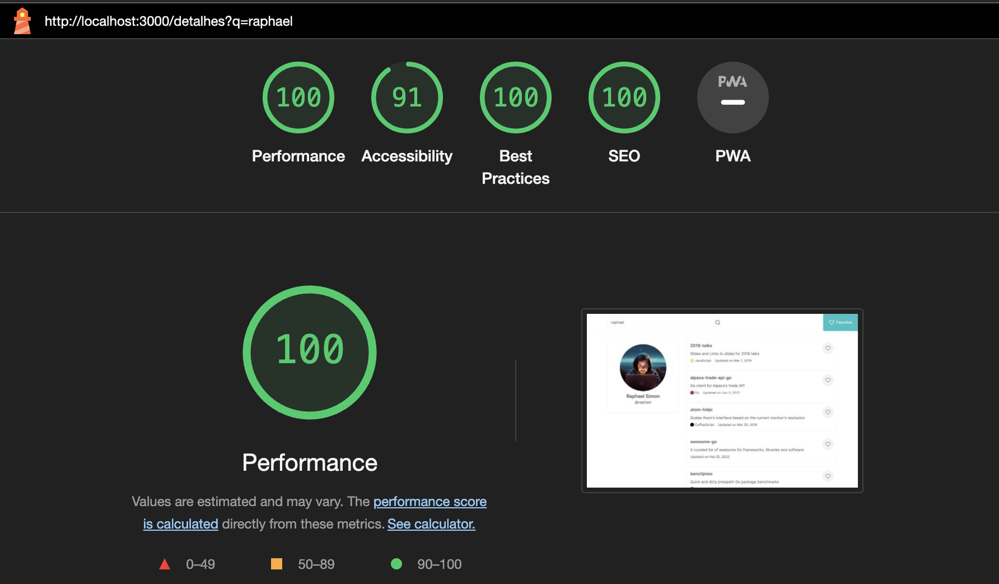

## Algumas decisões técnicas

### Arquitetura

Optei por construir a aplicação utilizando alguns conceitos da `clean architecture` mesmo tratando de um projeto de natureza mais simples. Em cenários reais é recomendado utilizar abordagens mais robustas como essas para projetos de médio a grande porte, porém por se tratar de um teste técnico optei por seguir nessa linha para mostrar como seria uma aplicação com uma estrutura mais robusta.

A estruturação das pastas do projeto seguiu o seguinte modelo:

- **app/** : Pasta padrão do framework nextjs para trabalhar com o roteamento da aplicação

- **domain/** : Camada de domínio, a ideia dessa camada é ser o mais puro possível, sem ter nenhuma dependência externa como bibliotecas, apis, ou qualquer conector. O objetivo é manter toda `regra de negócio` da aplicação concentrada nessa camada.

- **infra/** : Camada onde fica a `implementação concentra` de todos recursos de infraestrutura da aplicação, como banco de dados, apis, ou qualquer outro conector. Para o exemplo desse desafio foi utilizado para implementação concreta dos repositório (classes que buscam as entidades de dominío de alguma fonte de dados), nesse contexto foi utilizado os cookies para persistência dos repositórios favoritos e a própria api do github como fonte de dados dos repositórios e detalhes dos usuários pesquisados).

- **ui/** : Camada onde está implementado recursos relacionados a `interface de usuário`, componentes, seções e utilitários relacionados ao visual do sistema.

- **main/** : Camada onde é feito a `injeção de dependências` de todos os componentes do sistema, é nessa camada que fazemos o link da camada de domínio com a camada de infra. Basicamente nessa camada é indicado quais recursos iremos usar em cada cenário.

### Tecnologias utilizadas

- Nextjs : Utilizamos uma abordagem de renderizacao pelo servidor com os `Server Componentes` e `Server Actions` na grande parte das funcionalidades. Em cenários reais essa abordagem é bem positiva em questões de `performance` e `SEO`.

- tailwind : Foi utilizado o `style guide` implementado no [figma](https://www.figma.com/design/NPsgIQuNZEv46Jy9u1d90E/Processo-Seletivo?node-id=0-1&t=tK3G8JBqsjRaSMOf-0)

- lucide : para os icones em si optei por usar os ícones da biblioteca lucide, optei por essa questão mais pela `praticidade` e pelo fato dos ícones serem bem parecidos com o presente no style guide

- eslint + prettier + husky + sonar : foram utilizados para garantir uma `padronização no código` e garantir o uso de `boas práticas` durante o desenvolviemnto

- vitest + react testing library : bibliotecas utilizadas para o desenvolvimento dos `testes unitários`

Resultado de um teste no lighthouse


### Algumas decisões

- **Utilização de cookies para persistência de dados**: Optei por usar os cookies para persistência de dados por conta do `suporte com server side` e por ser uma solução que fica armazenada no navegador do usuário (como não existe um sistema de autentição discartei o uso de algum banco de dados externo pois necessitaria de alguma recurso para garantir a identificação de cada usuário). O problema é que o limite de armazenamento dos cookies é relativamente pequeno (se não me engano 4kb para cada cookie), ou seja, provavelmente não deve ser muito difícil atingir esse limite com a solução atual. Uma outra opção talvez melhor seria o uso do localstorage, porém optei por não seguir nesse caminho por conta do suporte com o server side. Os cookies eles são comportilhados com o servidor oque permite pre renderizar a página de favoritos, enquanto com localsorage eu so conseguiria acesso as informações do repositórios favoritos durante a execução no client / client side.

- **Debounce para pesquisa dos usuários**: Optei por fazer o sistema de busca dos usuários / repositórios utilizando a estratégia de debounce, conforme o usuário digita no input existe um delay que caso o usuário não digite nada após, ele automaticamente já realiza a busca do usuário, sem a necessidade dele clicar em nada para confirmar a solicitação de busca. Essa estratégia é bem comum em diferentes cenário da web. Utilizei 800ms como valor de delay para função de debounce, não existe um valor correto para se utilizar, mas isso pode gerar alguns fatores na usabilidade, por exemplo, caso o usuário demore demais para digitar por completo o nome pode ser que o sistema realize a operação de busca "antes da hora", o que pode impactar na experiência do usuário.

### Abertura de melhorias

Vou listar aqui em baixo alguns aspectos que poderiam ser melhor trabalhados:

- aumentar cobertura de testes unitários
- desenvolver testes e2e com cypress
- setup da aplicação via docker (para facilitar o setup ou deploy em qualquer ambiente)

## Configurando projeto

**Pré requisitos:**

- git
- node v18

```sh
# clonando repositório via HTTPS
$ git clone https://github.com/RaphaelOliveiraMoura/teste-casarme.git

# ou se preferir o clone via SSH
$ git clone git@github.com:RaphaelOliveiraMoura/teste-casarme.git
```

```sh
# instalando dependências
$ npm ci

# buildando aplicação
$ npm run build

# executando aplicação
$ npm run start
```

para executar o sistema em modo de desenvolvimento basta executar o comando:

```sh
$ npm run dev
```

## Executando testes

```sh
# testes unitários
$ npm run test

# gerando relatório de cobertura dos testes
$ npm run coverage
```

### Executando sonarqube

1. Instalar docker compose
2. Para evitar problemas ao iniciar o sonar, é recomendado executar o comando `sudo sysctl -w vm.max_map_count=262144` (LINUX)
3. Executar o comando `docker-compose -f sonar-docker-compose.yml up`
4. O sonar irá ficar disponível em http://localhost:9000 . O usuário padrão é `admin` e a senha padrão também é `admin`
5. Ao acessar a primeira vez com as credenciais citadas no passo anterior, vai ser necessário redefinir a senha, altere a senha para `root`. Caso deseje colocar outra senha diferente de `root`, certifique se alterar o arquivo `sonar-project.properties` com a senha escolhida
6. Antes de executar a analise do codigo, é necessário rodar o coverage dos testes automatizados, com o comando `npm run coverage`
7. Para executar a analise do código, podemos executar o comando `docker run --rm --net host -v "$(pwd):/usr/src" sonarsource/sonar-scanner-cli -X`. Que irá executar a ferramenta sonar-scanner para analisar o codigo fonte, seguindo as configurações do arquivo `sonar-project.properties`
